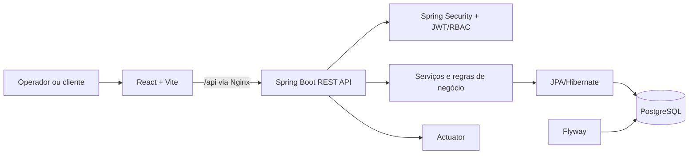
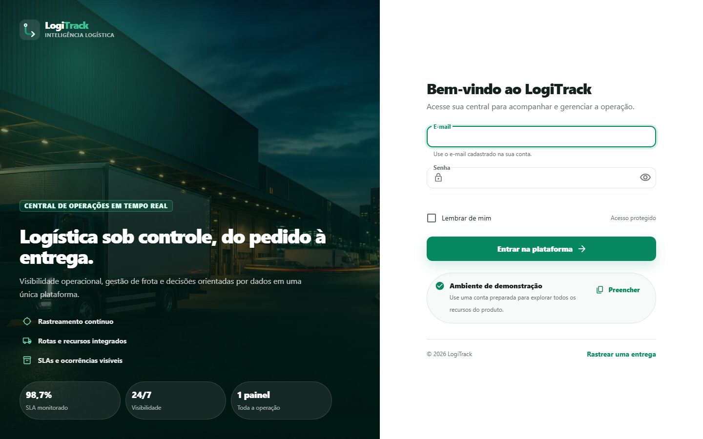
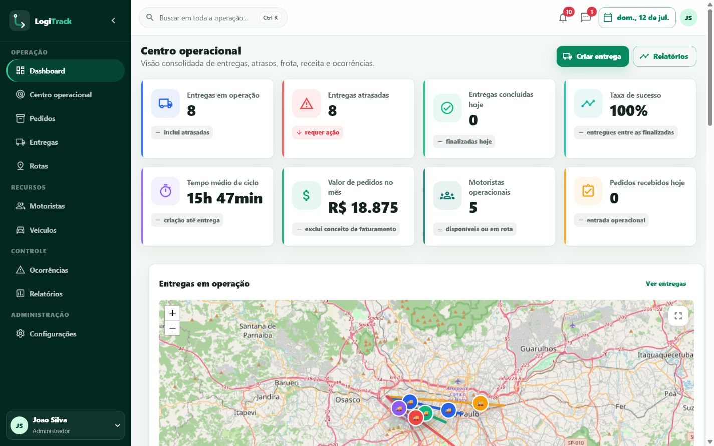
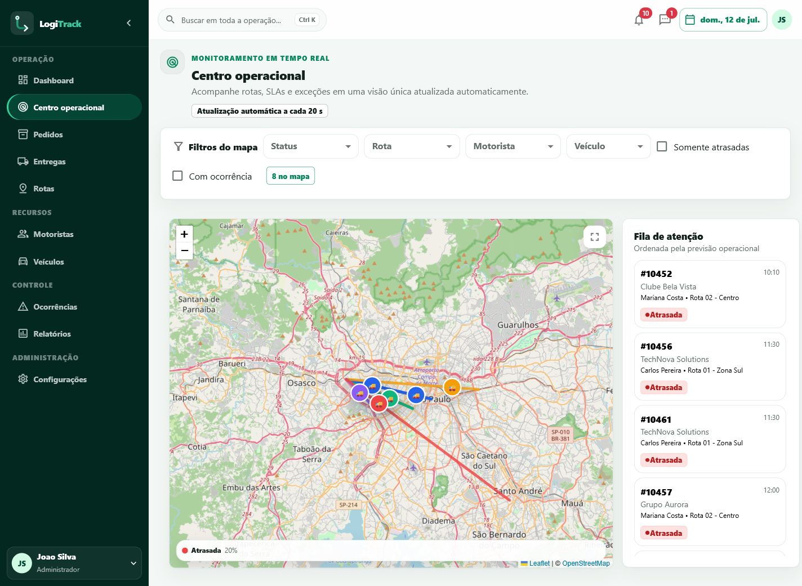
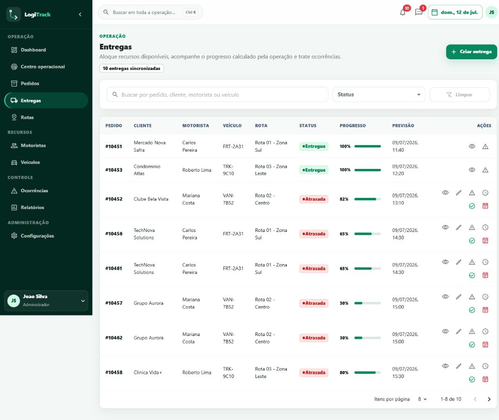
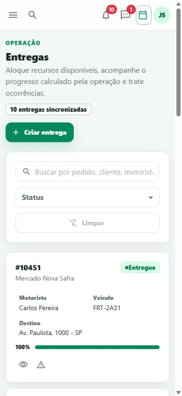
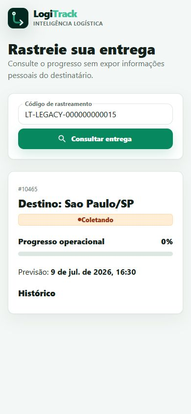

# LogiTrack

Plataforma full stack para planejamento, execução e acompanhamento de entregas. O LogiTrack reúne pedidos, alocação de frota, rotas, ocorrências, comunicação operacional, indicadores e rastreamento público em uma experiência web responsiva, construída para demonstrar práticas próximas às de um produto SaaS.

> O perfil `demo` inclui credenciais e dados fictícios para avaliação local. Ele não deve ser habilitado em produção.

## Visão do produto

Operações logísticas costumam se fragmentar entre planilhas, mensagens e telas isoladas. O LogiTrack oferece uma fonte única para a equipe:

- decidir o que precisa de atenção por meio do dashboard e do centro operacional;
- criar pedidos e entregas sem permitir alocações incompatíveis;
- acompanhar status, progresso, SLA, rota e histórico de cada entrega;
- administrar motoristas, veículos, rotas e ocorrências;
- pesquisar entidades, consultar agenda, receber alertas e conversar no contexto da operação;
- compartilhar um código de rastreamento que não expõe dados pessoais do cliente.

## Principais recursos

### Operação

- Dashboard com métricas, gráficos, próximas entregas, ocorrências recentes e fila operacional.
- Centro operacional com mapa Leaflet/OpenStreetMap, filtros por status e atualização automática a cada 20 segundos.
- CRUDs de pedidos, entregas, motoristas, veículos, rotas e ocorrências, com estados de carregamento, vazio e erro.
- Timeline persistida da entrega e progresso derivado do status no backend.
- Reagendamento, conclusão e cancelamento de entregas com sincronização dos recursos associados.
- Registro de ocorrências por prioridade, vínculo com pedido ou entrega e fluxo explícito de resolução.
- Relatórios operacionais com gráficos e exportações disponíveis pela interface.

### Plataforma

- Busca global agrupada por tipo de entidade.
- Central de notificações persistidas, com leitura individual, leitura em lote e exclusão.
- Conversas persistidas, pesquisa e envio de mensagens em contexto operacional.
- Agenda diária consolidada a partir das entregas.
- Trilha de auditoria para ações relevantes, restrita a administradores.
- Rastreamento público por código, com resposta reduzida e sem nome, telefone ou endereço completo do cliente.
- Interface responsiva, navegação agrupada, estados 403/404/500/offline, foco visível e suporte a redução de movimento.

## Diferenciais técnicos

- Regras críticas centralizadas no backend; status calculados e identificadores não dependem do formulário do navegador.
- Controle de concorrência com transações, consultas com lock para alocação e versão da entrega.
- Operações terminais idempotentes: concluir ou cancelar novamente não duplica métricas nem efeitos.
- Cache e sincronização de dados no frontend com TanStack Query.
- Migrações versionadas com Flyway e validação do schema pelo Hibernate.
- API stateless com JWT, RBAC, rate limit de login, erros JSON padronizados e correlação de requisições.
- Imagens Docker multi-stage, execução do backend com usuário sem privilégios e healthchecks de aplicação.
- CI separada para backend, frontend e validação do contrato Docker Compose.

## Arquitetura



O frontend é uma SPA com carregamento de páginas sob demanda. Em produção no Compose, o Nginx serve os arquivos estáticos e encaminha `/api` ao backend. A API está organizada em controllers, serviços transacionais, repositórios JPA e entidades de domínio. O PostgreSQL é a fonte persistente; o H2 é usado apenas nos testes automatizados.

## Regras de negócio implementadas

- Novos pedidos recebem número imutável no padrão `PED-yyMMdd-xxxxxx` e código de rastreamento gerados pelo servidor.
- Pedidos concluídos ou cancelados não podem ser editados; um pedido entregue não pode ser cancelado.
- Um pedido, motorista ou veículo não pode participar de duas entregas ativas simultaneamente.
- Apenas motoristas e veículos disponíveis podem ser alocados; veículo em manutenção é rejeitado.
- O peso do pedido não pode exceder a capacidade do veículo.
- Quando informada, a rota de uma entrega precisa estar ativa.
- O backend define o status inicial e calcula o progresso; mudanças obedecem a uma matriz de transições.
- A conclusão libera motorista e veículo, atualiza o pedido e incrementa a produtividade do motorista uma única vez.
- O cancelamento libera os recursos e devolve um pedido não cancelado ao estado pendente.
- Cancelar um pedido encerra suas entregas ativas e libera os recursos associados.
- Entregas ativas que ultrapassam a previsão são marcadas como atrasadas durante a atualização operacional e geram notificação de SLA.
- Uma ocorrência precisa estar vinculada a um pedido ou entrega. A resolução exige descrição e uma ocorrência resolvida não pode ser cancelada.
- Distância, coordenadas e tempo da rota são calculados pelo servidor. No modo atual, o geocoding é determinístico e demonstrativo.

## Segurança

- Autenticação stateless com JWT e senhas BCrypt.
- Autorização por perfil no backend: `ADMIN`, `OPERATOR`, `MONITORING`, `FLEET_MANAGER`, `DRIVER` e `VIEWER`.
- Operadores administram pedidos, entregas, rotas e ocorrências; gestores de frota administram motoristas e veículos; auditoria exige `ADMIN`.
- Rate limit por combinação de IP e conta no login, configurável por quantidade de tentativas e janela de tempo.
- CORS com lista explícita de origens, respostas JSON para 401/403 e mensagens internas não expostas nos erros HTTP.
- Identificador de correlação por requisição e logs estruturados no console.
- Headers defensivos no Nginx, frontend e backend publicados apenas em `127.0.0.1` no Compose.
- No perfil `prod`, o segredo JWT é obrigatório e Swagger/OpenAPI é desabilitado.

Consulte também a [política de segurança](SECURITY.md).

## Stack

| Camada | Tecnologias |
|---|---|
| Frontend | React 18, TypeScript 5, Vite 5, Material UI 6, React Router 6 |
| Dados no cliente | TanStack Query 5, Axios |
| Visualização | Recharts, Leaflet, React Leaflet, OpenStreetMap |
| Backend | Java 17, Spring Boot 3.3, Spring Web, Spring Validation |
| Segurança | Spring Security, JJWT 0.12, BCrypt |
| Persistência | Spring Data JPA, Hibernate, PostgreSQL 16, Flyway |
| Testes | JUnit 5, Spring Boot Test, MockMvc, H2, Vitest, Testing Library, jsdom |
| Infraestrutura | Docker, Docker Compose, Nginx, Spring Boot Actuator, GitHub Actions |

## Estrutura do repositório

```text
.
|-- backend/
|   |-- src/main/java/com/logitrack/
|   |   |-- config/          # segurança, OpenAPI e seeds demo
|   |   |-- controller/      # endpoints REST
|   |   |-- domain/          # entidades e enums
|   |   |-- dto/             # contratos de entrada e saída
|   |   |-- exception/       # erros e handler global
|   |   |-- repository/      # Spring Data JPA e locks
|   |   |-- security/        # JWT, filtros e rate limit
|   |   `-- service/         # regras de negócio transacionais
|   |-- src/main/resources/
|   |   `-- db/migration/    # migrações Flyway
|   `-- src/test/            # testes de serviço, integração e autorização
|-- frontend/
|   |-- public/              # manifest e ícones da aplicação
|   |-- scripts/             # geração dos favicons
|   `-- src/
|       |-- api/             # cliente HTTP e tipos
|       |-- components/      # shell, dados, mapa e componentes compartilhados
|       |-- contexts/        # sessão de autenticação
|       |-- hooks/           # consultas e estado de conectividade
|       |-- pages/           # páginas funcionais
|       `-- theme/           # tema e tokens visuais
|-- .github/workflows/ci.yml
|-- docker-compose.yml
|-- .env.example
|-- SECURITY.md
`-- README.md
```

## Pré-requisitos

Para a execução recomendada:

- Docker Engine 24+ com Docker Compose v2.

Para desenvolvimento local sem construir os containers:

- Java 17 e Maven 3.9+;
- Node.js 20+ e npm;
- PostgreSQL 16 acessível pela API.

## Execução com Docker

1. Crie o arquivo de ambiente:

```bash
cp .env.example .env
```

No PowerShell:

```powershell
Copy-Item .env.example .env
```

2. Antes de publicar qualquer ambiente, altere `POSTGRES_PASSWORD` e gere um `LOGITRACK_JWT_SECRET` aleatório com pelo menos 32 bytes.

3. Construa e inicie a plataforma:

```bash
docker compose up --build -d
```

4. Acesse:

| Serviço | Endereço padrão |
|---|---|
| Aplicação | <http://localhost:3001> |
| API | <http://localhost:18080/api> |
| Swagger, exceto no perfil `prod` | <http://localhost:18080/swagger-ui.html> |
| Saúde da API | <http://localhost:18080/actuator/health> |
| Saúde do frontend | <http://localhost:3001/health> |

Os containers só publicam frontend e API na interface local. O PostgreSQL permanece na rede interna do Compose.

Comandos úteis:

```bash
docker compose ps
docker compose logs -f backend frontend
docker compose down
```

O volume `postgres_data` preserva os dados entre reinícios. `docker compose down -v` também apaga esse volume e deve ser usado apenas quando a perda dos dados for intencional.

## Execução local para desenvolvimento

### Backend

Crie o banco `logitrack` em uma instância PostgreSQL local e configure as variáveis conforme necessário. Os valores abaixo coincidem com os defaults de desenvolvimento:

```powershell
$env:SPRING_DATASOURCE_URL="jdbc:postgresql://localhost:5432/logitrack"
$env:SPRING_DATASOURCE_USERNAME="logitrack"
$env:SPRING_DATASOURCE_PASSWORD="logitrack"
$env:SPRING_PROFILES_ACTIVE="demo"
cd backend
mvn spring-boot:run
```

A API ficará em <http://localhost:8080>. Na inicialização, o Flyway aplica as migrações e o Hibernate valida o schema.

### Frontend

Em outro terminal:

```bash
cd frontend
npm install
npm run dev
```

Abra <http://localhost:5173>. O servidor Vite encaminha `/api` para `http://localhost:8080`. Para outro endereço de API, defina `VITE_API_URL` antes do build ou da execução.

## Ambiente de demonstração

Com `SPRING_PROFILES_ACTIVE=demo`, os seeds idempotentes criam dados operacionais e a conta:

- e-mail: `admin@logitrack.com`
- senha: `Admin@123`

O perfil padrão da configuração local também é `demo`. Para produção, use explicitamente `SPRING_PROFILES_ACTIVE=prod`; nesse perfil os seeds não são executados, as credenciais acima não existem e `LOGITRACK_JWT_SECRET` não possui fallback.

## Migrações e banco de dados

O schema é gerenciado pelo Flyway em `backend/src/main/resources/db/migration`. A migração inicial é compatível tanto com instalações novas quanto com bancos legados que eram atualizados pelo Hibernate. `spring.jpa.hibernate.ddl-auto=validate` impede alterações implícitas no schema.

Ao criar uma mudança de banco:

1. adicione uma nova migração versionada, sem editar uma versão já aplicada;
2. faça backup do banco persistente;
3. valide a migração em uma cópia representativa;
4. publique primeiro a versão compatível da API.

## API

A base autenticada é `/api`; envie `Authorization: Bearer <token>`. Apenas o login e o rastreamento público são anônimos.

### Recursos principais

| Método | Endpoint | Finalidade |
|---|---|---|
| `POST` | `/api/auth/login` | Autenticar e emitir JWT |
| `GET` | `/api/auth/me` | Recuperar usuário autenticado |
| `GET` | `/api/dashboard` | Consolidar indicadores e operação |
| `GET, POST` | `/api/orders` | Listar e criar pedidos |
| `GET, PUT, DELETE` | `/api/orders/{id}` | Consultar, editar e cancelar pedido |
| `GET, POST` | `/api/deliveries` | Listar e criar entregas |
| `GET, PUT, DELETE` | `/api/deliveries/{id}` | Consultar, editar e cancelar entrega |
| `PUT` | `/api/deliveries/{id}/status` | Avançar o status operacional |
| `POST` | `/api/deliveries/{id}/mark-delivered` | Concluir entrega de forma idempotente |
| `PUT` | `/api/deliveries/{id}/reschedule` | Reagendar previsão da entrega |
| `GET, POST` | `/api/drivers`, `/api/vehicles`, `/api/routes` | Listar e criar recursos |
| `GET, PUT, DELETE` | `/api/drivers/{id}`, `/api/vehicles/{id}`, `/api/routes/{id}` | Consultar, editar e encerrar recursos |
| `GET, POST` | `/api/incidents` | Listar e registrar ocorrências |
| `GET, PUT, DELETE` | `/api/incidents/{id}` | Consultar, editar e cancelar ocorrência |
| `POST` | `/api/incidents/{id}/resolve` | Resolver com descrição obrigatória |

### Plataforma operacional

| Método | Endpoint | Finalidade |
|---|---|---|
| `GET` | `/api/search?q={texto}&limit={1..25}` | Busca global; exige ao menos 2 caracteres |
| `GET` | `/api/notifications?unreadOnly={boolean}` | Listar alertas e contagem não lida |
| `PATCH` | `/api/notifications/{id}/read` | Marcar uma notificação como lida |
| `PATCH` | `/api/notifications/read-all` | Marcar todas como lidas |
| `DELETE` | `/api/notifications/{id}` | Excluir uma notificação |
| `GET` | `/api/conversations?query={texto}` | Listar e pesquisar conversas |
| `GET, PATCH` | `/api/conversations/{id}`, `/api/conversations/{id}/read` | Consultar e marcar conversa como lida |
| `POST` | `/api/conversations/{id}/messages` | Enviar mensagem |
| `GET` | `/api/calendar?date=AAAA-MM-DD` | Consultar agenda operacional do dia |
| `GET` | `/api/audit` | Consultar auditoria; somente `ADMIN` |
| `GET` | `/api/tracking/{code}` | Rastreamento público sem dados pessoais |

Os contratos completos podem ser explorados pelo Swagger no perfil de desenvolvimento.

## Testes e qualidade

Backend:

```bash
cd backend
mvn clean verify
```

Os testes cobrem autenticação, autorização por perfil, conflitos de alocação, capacidade do veículo, rota ativa, imutabilidade do número do pedido, idempotência e endpoints da plataforma.

Frontend:

```bash
cd frontend
npm ci
npm test
npm run build
```

O pipeline em `.github/workflows/ci.yml` executa os testes e o build em jobs independentes e valida `docker compose config` a cada pull request e nos pushes para `main` e `codex/**`.

## Healthchecks e observabilidade

- `GET /actuator/health`: usado pelos healthchecks do backend e do Compose.
- `GET /actuator/info` e `/actuator/metrics`: expostos pelo Actuator e protegidos pela autenticação, exceto o healthcheck.
- `GET /health` no frontend: resposta leve do Nginx para orquestração.
- Logs da API incluem timestamp, nível, logger, `requestId` e mensagem.

O projeto não inclui uma stack externa de métricas, traces ou armazenamento de logs; os endpoints e os logs são os pontos de integração para essa evolução.

## Screenshots

As capturas abaixo foram geradas contra a stack Docker integrada.

### Login



### Dashboard e centro operacional





### Entregas responsivas





### Rastreamento público



## Publicação em produção

Antes do deploy:

- use `SPRING_PROFILES_ACTIVE=prod`;
- defina um `LOGITRACK_JWT_SECRET` aleatório com pelo menos 32 bytes e armazene-o em um gerenciador de segredos;
- substitua as credenciais do PostgreSQL e mantenha o banco em rede privada;
- restrinja `LOGITRACK_ALLOWED_ORIGINS` aos domínios oficiais;
- termine TLS em um proxy reverso ou load balancer;
- preserve e monitore o volume do banco e mantenha backups testados;
- revise a retenção de auditoria e a política de dados conforme a LGPD;
- conecte logs e métricas à solução de observabilidade do ambiente;
- mantenha Swagger desabilitado e não habilite o seed `demo`.

As portas no Compose estão vinculadas a `127.0.0.1`, adequadas para publicação por um proxy na mesma máquina. Em uma plataforma de containers, adapte ingress, secrets, persistência e health probes ao orquestrador.

## Limitações conhecidas

- O mapa usa OpenStreetMap e posições derivadas dos dados da aplicação; não existe integração com GPS ou telemetria de veículos.
- O geocoding de rotas é uma aproximação determinística em torno de São Paulo e o tempo usa uma velocidade média fixa; não considera trânsito, pedágios ou restrições viárias.
- A atualização do centro operacional usa polling, não WebSocket ou SSE.
- O rate limit de login é mantido na memória do processo; múltiplas réplicas exigem um armazenamento compartilhado ou controle na borda.
- Mensagens e notificações são internas; não há integração com e-mail, SMS, WhatsApp ou push.
- Não há upload de comprovante, assinatura, foto ou documento fiscal.
- Relatórios e configurações ainda não formam um módulo de BI ou administração multiempresa completo.
- O projeto não implementa geofencing, otimização multi-stop, aplicativo de motorista ou modo offline com fila de escrita.

## Roadmap

- Telemetria real com GPS, geofencing e atualizações por WebSocket/SSE.
- Integração com provedor de mapas para geocoding, trânsito e otimização multi-stop.
- Aplicativo/PWA do motorista com prova de entrega, foto e assinatura.
- Notificações externas e escalonamento configurável de SLA.
- Rate limit distribuído, rotação de refresh tokens e revogação de sessão.
- Administração de usuários e permissões por organização.
- Dashboards históricos, exportação assíncrona e indicadores configuráveis.
- Observabilidade com OpenTelemetry, métricas agregadas e alertas.

## Licença

Nenhuma licença de redistribuição foi definida neste repositório. Consulte o mantenedor antes de reutilizar o código fora do contexto de avaliação.
